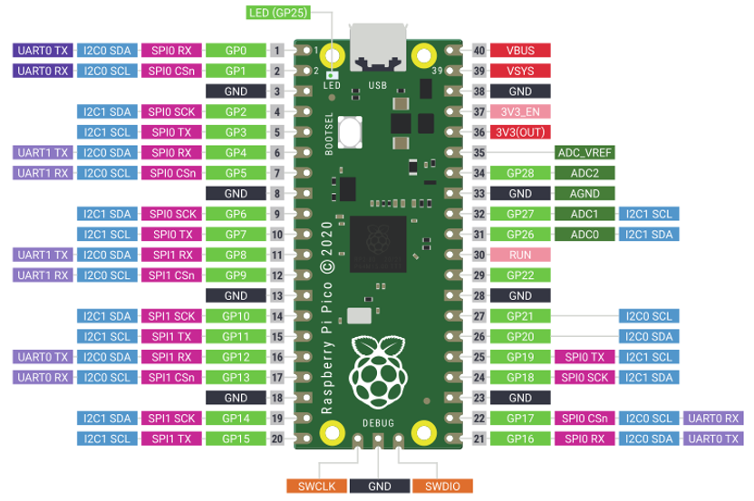

##############################################################################
Preface
##############################################################################

Raspberry Pi Pico is a tiny, fast, and versatile board built using RP2040, a brand new microcontroller chip designed by Raspberry Pi in the UK. Supporting Python and C/C++ development, it is perfect for DIY projects. In this tutorial, we use Arduino to learn Pico. If you want to learn the Python version, please refer to another tutorial: python_tutorial.pdf.

Using Arduino IDE as the development environment for Raspberry Pi Pico allows users to learn Pico better and more quickly, which is just like developing Arduino programs. In addition, resources such as Arduino's libraries can be directly used to greatly improve the efficiency of development.

If you have not downloaded the related material for Raspberry Pi Pico tutorial, you can download it from this link:

https://github.com/Freenove/Freenove_Ultimate_Starter_Kit_for_Raspberry_Pi_Pico

In this tutorial, we divide each project into 4 sections:

1, Component list: helps users to learn and find what components are needed in each project. 

2, Component Knowledge: allows you to learn the features and usage of the components. 

3, Circuit: assists to build circuit for each project. 

4, Sketches and comments: makes it easier for users to learn to use Raspberry Pi Pico and make secondary development. 

After completing the projects in this tutorial, you can also combine the components in different projects to make your own smart homes, smart car, robot, etc., bringing your imagination and creativity to life with Raspberry Pi Pico.

If you have any problems or difficulties using this product, please contact us for quick and free technical support: support@freenove.com

Raspberry Pi Pico
*********************************

:red:`Raspberry Pi Pico applies to all chapters except Wireless in this tutorial.`

Before learning Pico, we need to know about it. Below is an imitated diagram of Pico, which looks very similar to the actual Pico.

The hardware interfaces are distributed as follows:

.. image:: ../_static/imgs/Preface/Preface01.png
    :align: center

.. list-table:: 
   :width: 100%
   :header-rows: 1 
   :align: center
   
   * -  Frame color
     -  Description

   * -  |Preface02|
     -  Pins

   * -  |Preface03|
     -  BOOTSE button

   * -  |Preface04|
     -  USB port

   * -  |Preface05|
     -  LED

   * -  |Preface06|
     -  Debugging

.. |Preface02| image:: ../_static/imgs/Preface/Preface02.png

.. |Preface05| image:: ../_static/imgs/Preface/Preface05.png

Function definition of pins:

.. list-table:: 
   :width: 100%
   :header-rows: 1 
   :align: center
   
   * -  Color
     -  Pins
     -  Color
     -  Pins

   * -  |Preface08|
     -  GND
     -  |Preface09|
     -  Power

   * -  |Preface10|
     -  GPIO
     -  |Preface11|
     -  ADC

   * -  |Preface12|
     -  UART(default)
     -  |Preface13|
     -  UART

   * -  |Preface14|
     -  SPI
     -  |Preface15|
     -  I2C

   * -  |Preface16|
     -  System Control
     -  |Preface17|
     -  Debugging

.. |Preface08| image:: ../_static/imgs/Preface/Preface08.png
.. |Preface09| image:: ../_static/imgs/Preface/Preface09.png
.. |Preface10| image:: ../_static/imgs/Preface/Preface10.png

.. |Preface13| image:: ../_static/imgs/Preface/Preface13.png
.. |Preface14| image:: ../_static/imgs/Preface/Preface14.png

For details: https://datasheets.raspberrypi.org/pico/pico-datasheet.pdf

.. _defaultPin:

UART, I2C, SPI Default Pin
==============================================

In Arduino IDE, the default pins of serial port are Pin0 and Pin1. 

.. note:: 
    
    Serial port is virtualized by RP2040. Therefore, when using the serial port, please enable the verification function of DTR. It can work under any baud rate.

UART
----------------------------------------

.. list-table:: 
   :width: 100%
   :header-rows: 1 
   :align: center
   
   * -  Function
     -  Default
   
   * -  UART_BAUDRATE
     -  X

   * -  UART_BITS
     -  8

   * -  UART_STOP
     -  1

   * -  UART_TX
     -  Pin 0

   * -  UART_RX
     -  Pin 1

I2C
------------------------------

.. list-table:: 
   :width: 100%
   :header-rows: 1 
   :align: center
   
   * -  Function
     -  Default
   
   * -  I2C Frequency
     -  400000

   * -  I2C_SDA
     -  Pin 4

   * -  I2C_SCL
     -  Pin 5

SPI
------------------------------

.. list-table:: 
   :width: 100%
   :header-rows: 1 
   :align: center
   
   * -  Function
     -  Default
   
   * -  SPI_BAUDRATE
     -  1000000

   * -  SPI_POLARITY
     -  0

   * -  SPI_PHASE
     -  0

   * -  SPI_BITS
     -  8

   * -  SPI_FIRSTBIT
     -  MSB

   * -  SPI_SCK
     -  Pin 18

   * -  SPI_MOSI
     -  Pin 19

   * -  SPI_MISO
     -  Pin 16

   * -  SPI_SS
     -  Pin 17

Raspberry Pi Pico W
*************************************

:red:`Raspberry Pi Pico W applies to all chapters in this tutorial.`

Raspberry Pi Pico W adds CYW43439 as the WiFi function based on Raspberry Pi Pico. It is connected to RP2040 chip through SPI interface.

The hardware interfaces are distributed as follows:

.. list-table:: 
   :width: 100%
   :header-rows: 1 
   :align: center
   
   * -  Frame color
     -  Description

   * -  |Preface02|
     -  Pins

   * -  |Preface03|
     -  BOOTSE button

   * -  |Preface04|
     -  USB port

   * -  |Preface05|
     -  LED

   * -  |Preface06|
     -  Debugging

   * -  |Preface20|
     -  Wireless

Function definition of pins:

.. image:: ../_static/imgs/Preface/Preface21.png
    :align: center

.. list-table:: 
   :width: 100%
   :header-rows: 1 
   :align: center
   
   * -  Color
     -  Pins
     -  Color
     -  Pins

   * -  |Preface08|
     -  GND
     -  |Preface09|
     -  Power

   * -  |Preface10|
     -  GPIO
     -  |Preface11|
     -  ADC

   * -  |Preface12|
     -  UART(default)
     -  |Preface13|
     -  UART

   * -  |Preface14|
     -  SPI
     -  |Preface22|
     -  I2C

   * -  |Preface16|
     -  System Control
     -  |Preface17|
     -  Debugging

.. |Preface22| image:: ../_static/imgs/Preface/Preface22.png

For details: https://datasheets.raspberrypi.com/picow/pico-w-datasheet.pdf

UART, I2C, SPI Default Pin
==============================================

In Arduino IDE, the default pins of serial port are Pin0 and Pin1. 

.. note:: 
    
    Serial port is virtualized by RP2040. Therefore, when using the serial port, please enable the verification function of DTR. It can work under any baud rate.

UART
----------------------------------------

.. list-table:: 
   :width: 100%
   :header-rows: 1 
   :align: center
   
   * -  Function
     -  Default
   
   * -  UART_BAUDRATE
     -  X

   * -  UART_BITS
     -  8

   * -  UART_STOP
     -  1

   * -  UART_TX
     -  Pin 0

   * -  UART_RX
     -  Pin 1

I2C
------------------------------

.. list-table:: 
   :width: 100%
   :header-rows: 1 
   :align: center
   
   * -  Function
     -  Default
   
   * -  I2C Frequency
     -  400000

   * -  I2C_SDA
     -  Pin 4

   * -  I2C_SCL
     -  Pin 5

SPI
------------------------------

.. list-table:: 
   :width: 100%
   :header-rows: 1 
   :align: center
   
   * -  Function
     -  Default
   
   * -  SPI_BAUDRATE
     -  1000000

   * -  SPI_POLARITY
     -  0

   * -  SPI_PHASE
     -  0

   * -  SPI_BITS
     -  8

   * -  SPI_FIRSTBIT
     -  MSB

   * -  SPI_SCK
     -  Pin 18

   * -  SPI_MOSI
     -  Pin 19

   * -  SPI_MISO
     -  Pin 16

   * -  SPI_SS
     -  Pin 17

Wireless
----------------------------------------

.. list-table:: 
   :width: 100%
   :header-rows: 1 
   :align: center
   
   * -  Function
     -  Default
   
   * -  WL_ON
     -  GPIO23

   * -  WL_D
     -  GPIO24

   * -  WL_CLK
     -  GPIO29_ADC

   * -  WL_CS
     -  GPIO25

Raspberry Pi Pico 2
*****************************************

Raspberry Pi Pico 2 is applicable to all chapters in this tutorial except RFID and those involving WiFi. 

Raspberry Pi Pico 2 uses RP2350 chip as the main controller, which equipped with dual Cortex-M33 or Hazard3 processors, capable of running up to 150 MHz, providing a significant boost in processing power, compared with the original Pico. It also doubles the memory with 520KB of SRAM and 4MB of onboard flash memory, with the ADC sampling frequency increasing to up to 500ksps. In addition, it adds 8 more PWM channels, and features additional interfaces like 2× Timer with 4 alarms, 1× AON Timer and 4 x PIO.

The hardware interfaces are distributed as follows:

.. image:: ../_static/imgs/Preface/Preface24.png
    :align: center

.. list-table:: 
   :width: 100%
   :header-rows: 1 
   :align: center
   
   * -  Frame color
     -  Description

   * -  |Preface02|
     -  Pins

   * -  |Preface03|
     -  BOOTSE button

   * -  |Preface04|
     -  USB port

   * -  |Preface05|
     -  LED

   * -  |Preface06|
     -  Debugging

Function definition of pins:

.. list-table:: 
   :width: 100%
   :header-rows: 1 
   :align: center
   
   * -  Color
     -  Pins
     -  Color
     -  Pins

   * -  |Preface08|
     -  GND
     -  |Preface09|
     -  Power

   * -  |Preface10|
     -  GPIO
     -  |Preface11|
     -  ADC

   * -  |Preface12|
     -  UART(default)
     -  |Preface13|
     -  UART

   * -  |Preface14|
     -  SPI
     -  |Preface22|
     -  I2C

   * -  |Preface16|
     -  System Control
     -  |Preface17|
     -  Debugging

For details: https://datasheets.raspberrypi.com/pico/pico-2-datasheet.pdf

UART, I2C, SPI Default Pin
==============================================

In Arduino IDE, the default pins of serial port are Pin0 and Pin1. 

.. note:: 
    
    Serial port is virtualized by RP2040. Therefore, when using the serial port, please enable the verification function of DTR. It can work under any baud rate.

UART
----------------------------------------

.. list-table:: 
   :width: 100%
   :header-rows: 1 
   :align: center
   
   * -  Function
     -  Default
   
   * -  UART_BAUDRATE
     -  X

   * -  UART_BITS
     -  8

   * -  UART_STOP
     -  1

   * -  UART_TX
     -  Pin 0

   * -  UART_RX
     -  Pin 1

I2C
------------------------------

.. list-table:: 
   :width: 100%
   :header-rows: 1 
   :align: center
   
   * -  Function
     -  Default
   
   * -  I2C Frequency
     -  400000

   * -  I2C_SDA
     -  Pin 4

   * -  I2C_SCL
     -  Pin 5

SPI
------------------------------

.. list-table:: 
   :width: 100%
   :header-rows: 1 
   :align: center
   
   * -  Function
     -  Default
   
   * -  SPI_BAUDRATE
     -  1000000

   * -  SPI_POLARITY
     -  0

   * -  SPI_PHASE
     -  0

   * -  SPI_BITS
     -  8

   * -  SPI_FIRSTBIT
     -  MSB

   * -  SPI_SCK
     -  Pin 18

   * -  SPI_MOSI
     -  Pin 19

   * -  SPI_MISO
     -  Pin 16

   * -  SPI_SS
     -  Pin 17